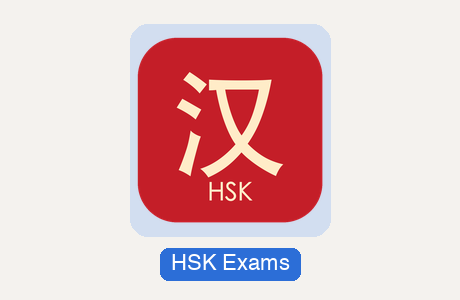
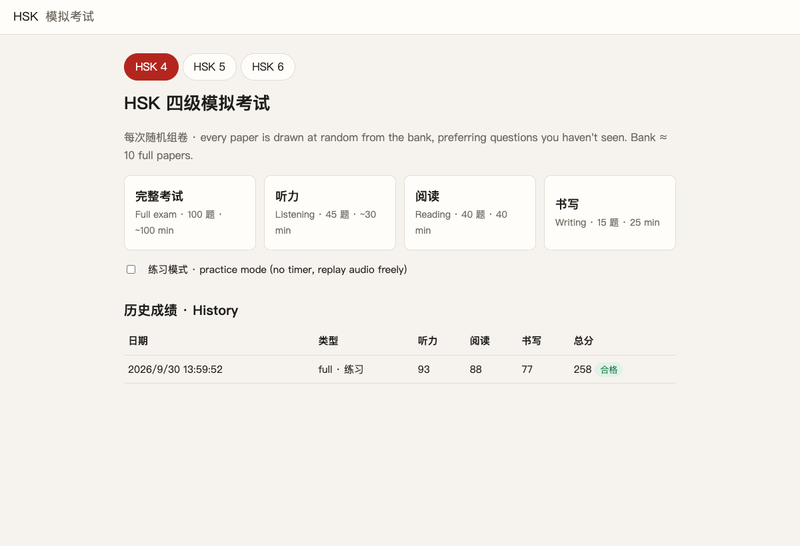
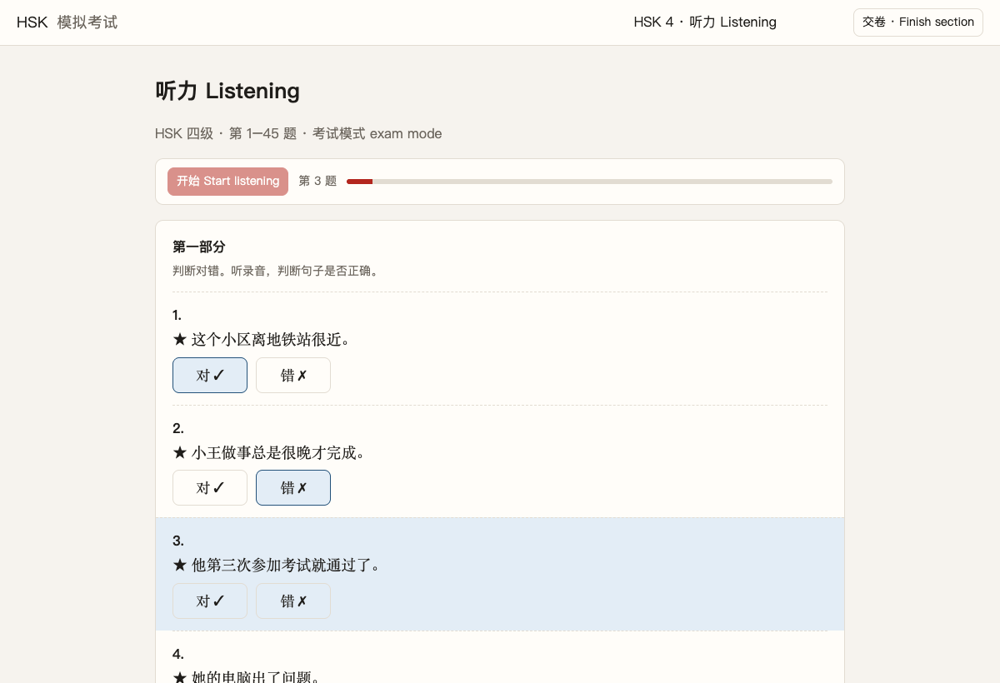
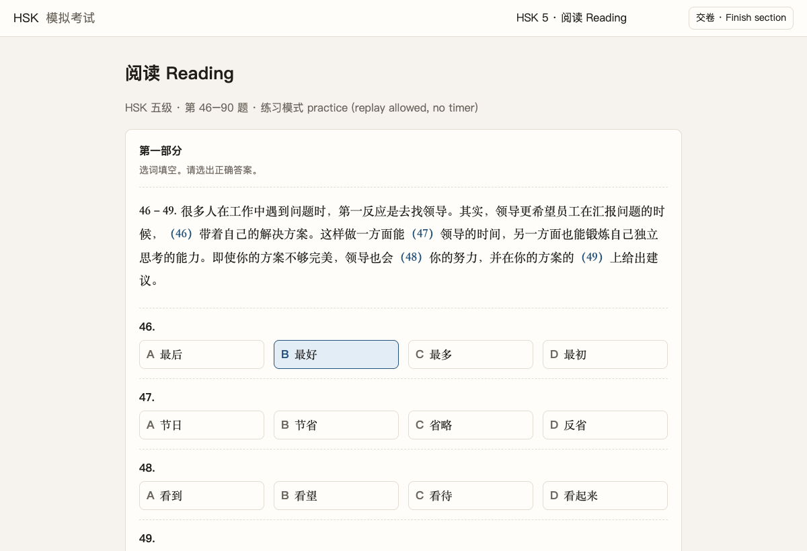
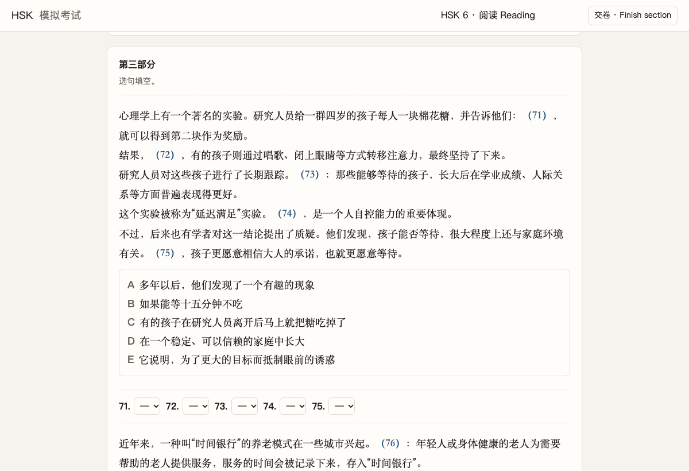
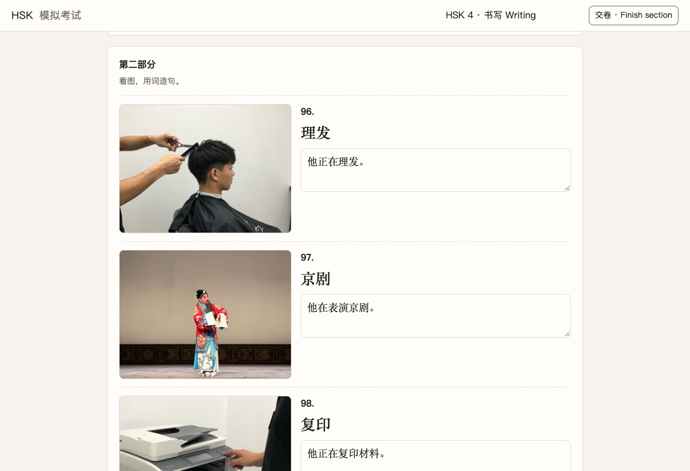
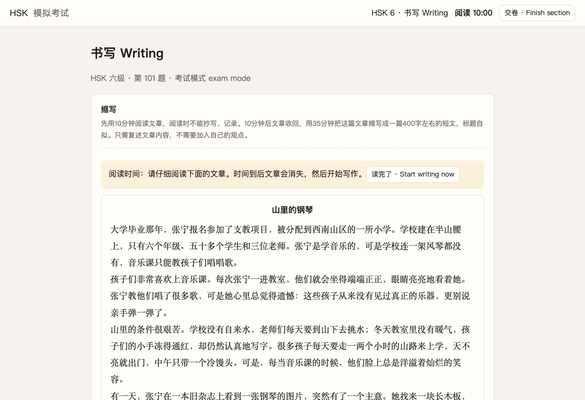
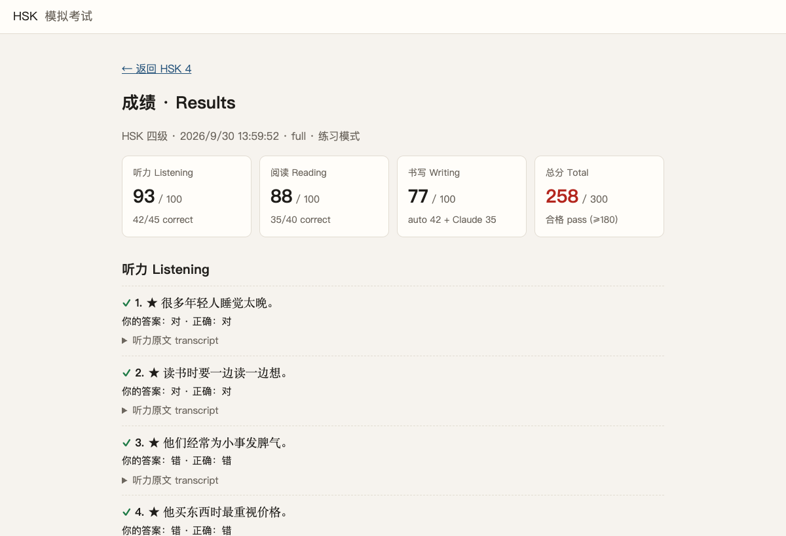
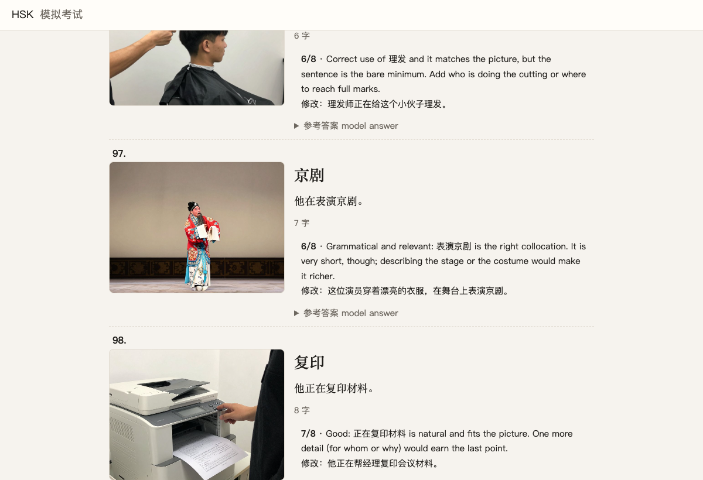

```text
██╗  ██╗███████╗██╗  ██╗     ██╗███╗   ██╗███████╗██╗███╗   ██╗██╗████████╗███████╗
██║  ██║██╔════╝██║ ██╔╝     ██║████╗  ██║██╔════╝██║████╗  ██║██║╚══██╔══╝██╔════╝
███████║███████╗█████╔╝█████╗██║██╔██╗ ██║█████╗  ██║██╔██╗ ██║██║   ██║   █████╗  
██╔══██║╚════██║██╔═██╗╚════╝██║██║╚██╗██║██╔══╝  ██║██║╚██╗██║██║   ██║   ██╔══╝  
██║  ██║███████║██║  ██╗     ██║██║ ╚████║██║     ██║██║ ╚████║██║   ██║   ███████╗
╚═╝  ╚═╝╚══════╝╚═╝  ╚═╝     ╚═╝╚═╝  ╚═══╝╚═╝     ╚═╝╚═╝  ╚═══╝╚═╝   ╚═╝   ╚══════╝
```

**HSK 4 / 5 / 6 mock exams, a fresh paper every time.** Each paper is drawn at random from a bank of
original questions (15 full papers per level before any item repeats; HSK 2.0 format, plus a
新HSK 4 tab in the new HSK 3.0 format; 300
points, 180 to pass), with spoken listening audio, timed sections and instant scoring in your browser. Free writing (HSK 4 看图造句, HSK 5 短文, HSK 6 缩写) is graded by
[Claude Code](https://claude.com/claude-code) against the exam rubrics.

## Quick start

**Mac:** double-click **HSK Exams.app** in this folder. It starts a small local server and opens
the exams in your browser. That's it — no installs, no accounts, nothing leaves your computer.

<p align="center"></p>

Keep the app inside this folder (dragging it to the Dock just adds a shortcut). If macOS says it
"can't be opened" — which only happens when you download the repo as a zip instead of cloning —
right-click it → **Open** once. The server keeps running in the background; stop it with
`pkill -f server.py`.

**Any OS:** with Python 3.9+ (no packages needed):

```sh
python3 server.py
# then open http://localhost:8004
```

## How to use it

### 1. Pick a level and a mode

Choose HSK 4, 5 or 6 at the top, then a full exam or a single section. **Exam mode** is timed and
plays the listening once, straight through, like the real test. Tick **practice mode** for no
timer and free replay. Your past scores are listed under 历史成绩 · History.



### 2. Listening

In exam mode press 开始 · Start listening: the narrator announces each question, plays the
recording and pauses for you to answer, while the bar shows where you are. In practice mode every
question gets its own ▶ 播放 button.



### 3. Reading

All the HSK 2.0 reading question types are covered, from word banks and cloze passages…



…through to HSK 6 病句, word-set cloze and sentence insertion.



### 4. Writing

HSK 4 asks for a sentence about each picture using the given word; HSK 5 for two short essays.



HSK 6 缩写 works like the real exam: 10 minutes to read the story, then it disappears and you
have 35 minutes to retell it in ~400 字, with a live character counter.



### 5. Results

Press 交卷 · Finish section (click twice to confirm). Listening and reading are scored instantly;
you can review every answer, open listening transcripts, and read the explanation for each 病句.



### 6. Get your writing graded

Open [Claude Code](https://claude.com/claude-code) in this folder and say
*"grade my HSK writing"*. Claude looks at each picture, scores your answers with the official-style
rubric, and writes feedback plus a corrected version. The results page picks up the grade by
itself within a few seconds.



### 7. Drills, progress, missed words and exam day

The home page of each level also has:

- **单项练习 Drill one part**: one part of a paper (e.g. only HSK 6 病句 or HSK 5 cloze), untimed.
  Press **检查 Check** under an item to lock it and see the answer, the transcript, or the 病句
  explanation straight away. Drills are saved like any paper and count toward "least-seen first".
- **📈 进度 Progress**: section scores over time (exam and practice papers marked differently),
  accuracy by part with your weakest part called out, and a Drill button on every part.
- **📝 生词本 Missed words**: words from the questions you got wrong, tagged by HSK level with pinyin,
  meaning, how often you missed them and an example sentence. Tick ✓ for words you know, and
  **导出 Anki** downloads a tab-separated file for Anki's *File → Import*.
- **🎯 模拟考试日 Exam day**: a full paper under real conditions. A checklist (sound test, quiet
  room, time) comes first; after that there is no pausing, the listening section can't be ended
  before the recording finishes, an interrupted recording resumes at the *next* question, and
  leaving the tab is counted on the result.
- **🖨 答题卡 Answer sheet**: a printable HSK-style answer sheet with bubbles and 方格纸 writing
  grids, blank from the exam-day checklist or filled in from any result page.

More details:

- Each paper prefers the questions you've seen least, and answer options are reshuffled every time.
- Voice samples: http://localhost:8004/voices.html

## Exam formats used

| | Listening | Reading | Writing |
|---|---|---|---|
| **HSK 4** (100 Qs) | 1–10 true/false · 11–25 two-line dialogues · 26–35 long dialogues · 36–45 passages (2 Qs) | 46–55 word bank · 56–65 order A/B/C · 66–79 short passages · 80–85 passages (2 Qs) — 40 min | 86–95 arrange words · 96–100 picture + word → sentence — 25 min |
| **HSK 5** (100 Qs) | 1–20 two-line dialogues · 21–30 long dialogues · 31–45 passages (2–3 Qs) | 46–60 cloze (each blank its own options, some sentence-level) · 61–70 pick the matching statement · 71–90 passages (4 Qs) — 45 min | 91–98 arrange words · 99 essay with 5 given words · 100 picture essay (~80 字 each) — 40 min |
| **HSK 6** (101 Qs) | 1–15 pick the matching statement · 16–30 3 interviews (5 Qs) · 31–50 passages (3–4 Qs) | 51–60 病句 · 61–70 word-set cloze · 71–80 sentence insertion (A–E) · 81–100 passages (4 Qs) — 50 min | 101 缩写: read ~1000 字 (10 min), write ~400 字 (35 min) |
| **新HSK 4** (3.0, 70 Qs) | 1–14 short dialogues · 15–19 short talks · 20–29 talks (2 Qs) · 30–32 talk (3 Qs) — all 4-option | 33–42 two word banks (6 words, one distractor) · 43–50 short passages · 51–54 passages (2 Qs) · 55–57 passage (3 Qs) · 58–64 sentence insertion (3 + 4) — 30 min | 65–69 picture + word → sentence · 70 short essay ≥80 字 on a topic — 25 min |

The **新HSK 4** tab follows the new HSK 3.0 exam, using the official 2026 sample paper
(中外语言交流合作中心) for its structure, timing and listening announcements, and the 2025 syllabus word
lists (levels 1–4, 2000 words) for vocabulary. The new format also pairs every written exam from
level 3 up with a separate speaking paper (HSK四级口语). That paper isn't scored here, but the tab has a
**🎤 口语 Speaking** practice mode in the same three parts (听后复述 listen and repeat, 看图说话 describe a
picture, 回答问题 answer questions) with the official preparation and answer times: it records you in the
browser (nothing is uploaded) so you can listen back and compare with a model answer. The new pass mark
hasn't been published, so the 180/300 used here is an estimate, as are the writing weights
(5 × 10 + essay 50).

Scoring: each section is out of 100. Listening and reading scale with the number correct.
Writing is an **estimate** (the official weights aren't published):
HSK 4 = 10 × 6 + 5 × 0–8; HSK 5 = 8 × 5 + 2 × 0–30; HSK 6 = 缩写 0–100.
Rubrics are in `levels/<level>.json` and travel with each grading request.

Assumptions not taken from an official recording or paper: the formats above are from the
published HSK 2.0 structure (from knowledge, not a downloaded sample paper); each question is
announced as "第N题" and groups as "第X到Y题是根据下面一段话/采访"; answer pauses are 8–14 s
depending on the part; after listening there are 3 minutes to check answers.

## Question bank

Each level's bank holds enough units for 15 complete papers without repeating an item
(new papers draw the least-used units first; after that, items start to recur). Ambiguity-prone
items (HSK 4 word banks, A/B/C ordering and word arrangement, HSK 5 cloze, statement-matching
and word arrangement, HSK 6 病句, word-set cloze and sentence insertion)
were checked by an independent blind solve against shuffled options; every mismatch or
second defensible answer was rewritten. HSK 6 has 15 original 缩写 stories.

## Rebuilding the banks and media

The build and test tools need `python3 -m venv .venv && .venv/bin/pip install -r requirements.txt`
plus `ffmpeg` (audio). Pictures use Z-Image-Turbo through mflux on Apple Silicon; the ~10 GB model
is not in the repo — `build_images.py` explains how to fetch and quantize it.
`tools/build_vocab.py` (word meanings for the missed-words list) reads the HSK word data in
`../shared/ref` and, optionally, CC-CEDICT saved as `data/cedict.txt`; its outputs `site/vocab*.json` are committed.

## Layout

```
levels/          per-level config: sections, parts, question types, timing, scoring, rubrics
bank/<level>/    question bank, one JSON per part (schema: bank/SCHEMA.md)
data/            official HSK 2012 word lists (wordlists/L1–L6), whitelists, syllabus notes
tools/
  validate.py      structure, answer balance, near-duplicates, out-of-syllabus words, difficulty
  build_audio.py   edge-tts listening audio (cached; voices in audio_config.json)
  build_images.py  Z-Image-Turbo pictures (local, Apple Silicon; model in models/)
  add_batch.py / fix.py   add items / apply text fixes
  build_vocab.py   site/vocab.json (level, pinyin, meaning) for the missed-words list
  e2e_test.py      headless-Chrome test of a full exam per level, plus drill/progress/words/sheet/exam day
site/            the web app; audio/<level>/, images/<level>/
submissions/     attempts/ (your answers), pending/ (writing to grade), graded/ (Claude's grades)
server.py        local server + JSON API
```

## Sources

- Word meanings and pinyin in the missed-words list: the complete-hsk-vocabulary data (meanings from
  [CC-CEDICT](https://cc-cedict.org/), CC BY-SA 4.0); about 200 words missing there have glosses
  written for this project (`data/gloss_extra.tsv`). Pinyin for multi-reading words may list both.
- 新HSK 4: format from the official HSK 3.0 sample papers (2026) and vocabulary from the 2025
  《HSK考试大纲》 word lists (`data/wordlists_v3`, parsed by `tools/parse_syllabus_v3.py`). No sample
  item was copied; every question is original.
- Vocabulary: official HSK 2.0 (2012) word lists, levels 1–6. HSK 4 was cross-checked word by
  word against the vocabulary appendices of 《HSK标准教程4》上/下 (596 of 602 match).
- Grammar points and topics: the tables of contents of 《HSK标准教程》4上/4下/5上/6上.
  **Only the 上 volumes of HSK 5 and 6 were available**; the 下 halves are covered by the official
  word lists and general knowledge of the exam.
- All passages, dialogues and stories are original; none are copied from the textbooks.
